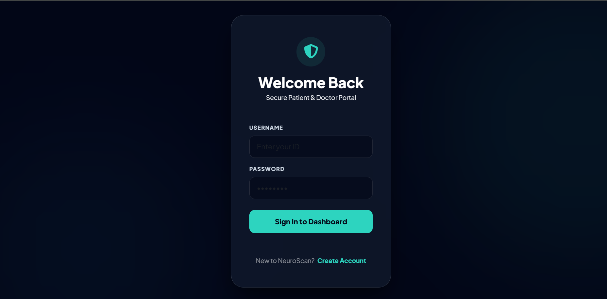
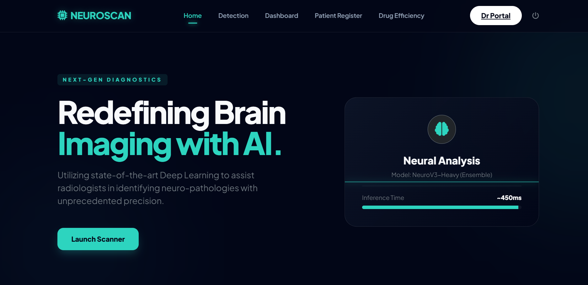
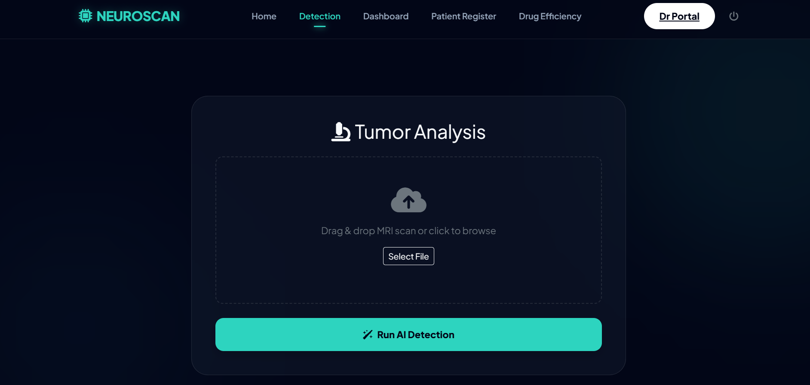
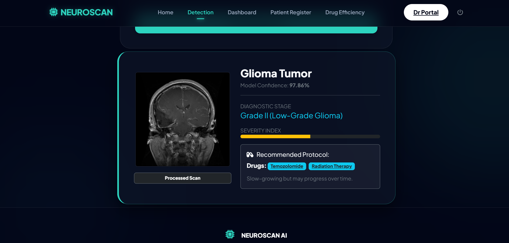
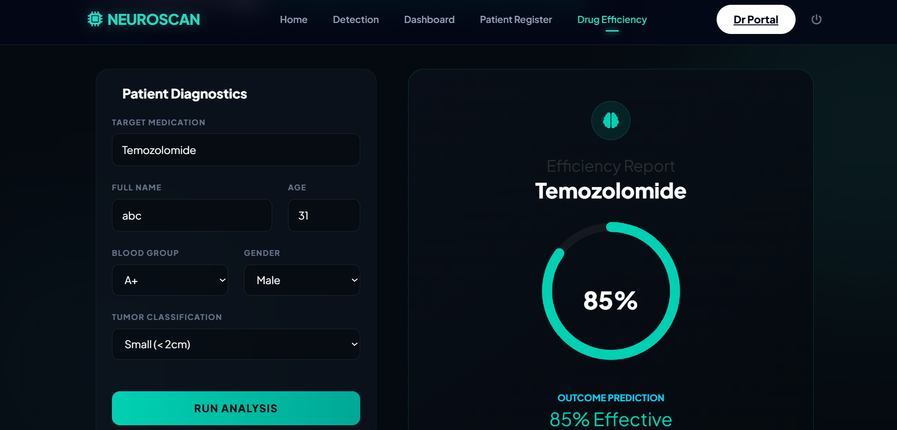
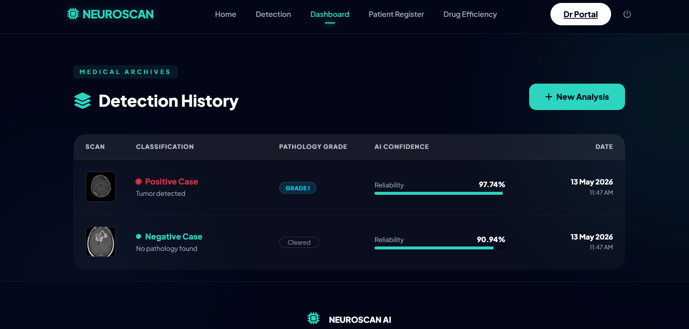
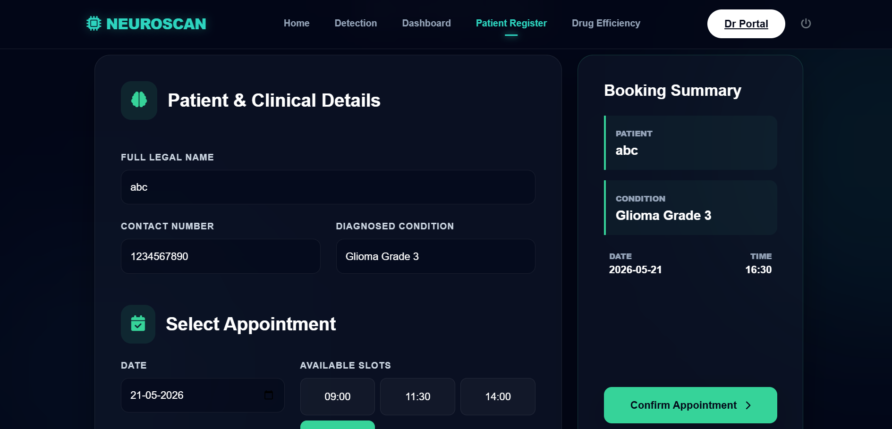
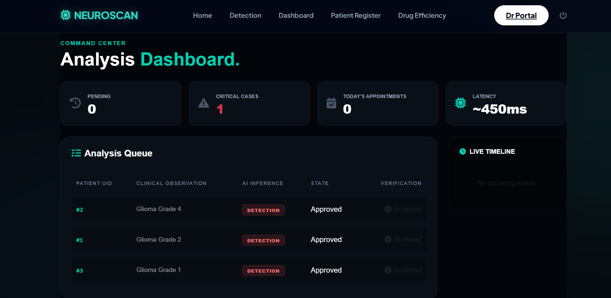

# 🧠 Brain Tumor Detection & Medical Decision Support System

---

## 📌 Overview

This is a **Django-based AI-powered web application** for detecting brain tumors from MRI scans using deep learning.

The system goes beyond detection and provides a **complete medical decision support workflow**, including:

- 🧠 Tumor detection from MRI images  
- 💊 Drug recommendation system  
- ⚗️ Drug efficiency checker  
- 📁 Patient history dashboard  
- 📅 Appointment booking system  
- 🩺 Doctor consultation panel  

A CNN-based deep learning model is used for MRI classification.

---

## 🚀 System Workflow
Home Page
↓
Login / Register
↓
MRI Detection Page
↓
Tumor Prediction + Drug Suggestion
↓
Click Drug → Drug Efficiency Page
↓
Dashboard (History Stored)
↓
Appointment Booking Page
↓
Doctor Login
↓
Doctor Dashboard (Accept / Reject Appointments)


---

## 🏠 Pages Overview

### 🏠 Home Page
- Landing page of the system  
- Navigation to all modules  

---

### 🧠 Detection Page
- Upload MRI scan image  
- CNN model detects:
  - Glioma Tumor  
  - No Tumor  
- Shows:
  - Prediction result  
  - Confidence score  
  - Recommended drugs  

---

### 💊 Drug Recommendation System
- Displays drugs based on tumor prediction  
- User can click on a drug  

➡️ Redirects to:

---

### ⚗️ Drug Efficiency Checker Page
- User enters or selects drug name  
- System evaluates:
  - Drug effectiveness  
  - Suitability for tumor type  
  - Efficiency score  

Output:
- High / Medium / Low effectiveness  
- AI-based recommendation  

---

### 📁 Dashboard Page (User History)
- Stores all previous detections  
- Shows:
  - MRI scan history  
  - Prediction results  
  - Drug suggestions  
- Helps users track medical history  

---

### 👤 Patient Registration / Appointment Page
- User registration and login  
- Book appointment with doctor  
- Features:
  - Date selection  
  - Reason for visit  
  - Status tracking (Pending / Approved / Rejected)  

---

### 🩺 Doctor Login Page
- Secure authentication for doctors  
- Role-based access control  

---

### 🩺 Doctor Dashboard
- Displays all patient appointments  
- Doctor can:
  - Accept appointment  
  - Reject appointment  
  - View patient details  

---

## 🧠 AI Model Workflow

1. MRI image uploaded  
2. Image preprocessing using OpenCV  
3. CNN extracts features  
4. Model predicts:
   - Glioma Tumor  
   - No Tumor  
5. Confidence score generated  
6. Drug suggestion displayed  
7. User can check drug efficiency  

---

## 🏗️ Tech Stack

| Layer | Technology |
|------|------------|
| Backend | Django (Python) |
| Frontend | HTML, CSS, Bootstrap |
| AI Model | TensorFlow / Keras |
| Image Processing | OpenCV, Pillow |
| Database | SQLite |
| Model Format | .h5 |

---

## 📁 Project Structure

```bash
brain_tumor_detection/
│
├── brain_tumor_detection/   # Django settings
│   ├── settings.py
│   ├── urls.py
│   ├── wsgi.py
│
├── detection/               # Main AI app
│   ├── models.py
│   ├── views.py
│   ├── urls.py
│
├── dataset/                 # Training MRI dataset
├── media/                   # Uploaded images
├── templates/               # HTML files
│   ├── index.html
│   ├── login.html
│   ├── dashboard.html
│
├── db.sqlite3
├── manage.py
├── brain_tumor.h5
├── requirements.txt
└── README.md
```


---

## 📷 Screenshots
### Login



---

### Dashboard



---

### Tumor Detection



---

### Result 



---


### Drug Efficiency 



---

### Dashboard



---

### Appointment



---

### Doctor Dashboard



---


## ⚙️ Installation

### Step 1 — Clone Repository

```bash
git clone https://github.com/shafa-21/brain-tumor-detection.git

```

---

### Step 2 — Move to Project Folder

```bash
cd brain-tumor-detection
```

---

### Step 3 — Install Dependencies

```bash
pip install -r requirements.txt
```

---

## ▶️ Run the Project

### Run Django Server

```bash
python manage.py runserver
```

---
## 📦 Requirements
- Django
- tensorflow
- numpy
- opencv-python
- pillow
- scikit-learn

## 🔐 Security Features
- Login required for predictions
- Role-based access (User / Doctor)
- Secure patient data storage
- Doctor-only dashboard access

## 📌 Future Enhancements
- 📄 Download medical reports (PDF generation)
- 🔬 Grad-CAM explainable AI visualization
- ☁️ Cloud deployment (AWS / Azure / Render)
- 🤖 Chatbot for patient assistance

# 👨‍💻 Author
- Shafa D
